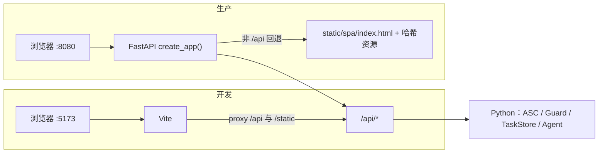
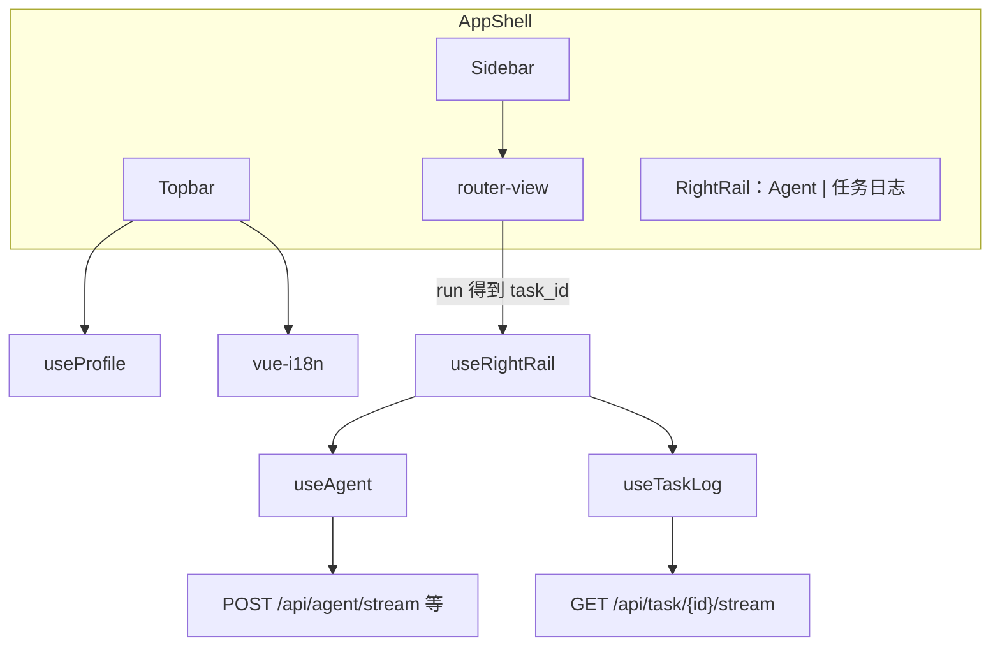

# Web Vue 3 SPA 重设计

**状态：** 已批准  
**日期：** 2026-08-15  
**范围：** 用 Vue 3 SPA 替换全部 Jinja 主 UI；FastAPI `/api/*` 继续作为唯一后端；一次交付、一次切换  

本文覆盖并取代：

| 旧规格 | 本文态度 |
|--------|----------|
| [2026-05-18-web-ui-design.md](./2026-05-18-web-ui-design.md) 的 HTMX / Alpine / Jinja 主 UI、扁平侧栏 | 作废。FastAPI + SSE + 复用 Python 业务逻辑仍有效 |
| [2026-07-21-dashboard-command-workspace-design.md](./2026-07-21-dashboard-command-workspace-design.md) 的指标、筛选、任务表 | 能力保留。右侧独立日志抽屉作废 |
| [2026-07-28-shared-task-log-drawer-design.md](./2026-07-28-shared-task-log-drawer-design.md) | 作废。日志并入全局右栏「任务日志」Tab |
| [2026-08-06-web-metadata-listing-preview-design.md](./2026-08-06-web-metadata-listing-preview-design.md) 的工作台/Diff/上传能力 | 能力保留。改为 `/listing` 同一路由下三个顶栏 Tab |
| [2026-08-13-web-failure-agent-design.md](./2026-08-13-web-failure-agent-design.md) 第 5、7–9、10.1–10.2、12、13.1–13.3 节 | **仍然有效**（工具、SSE 事件、gated apply、脱敏、replay） |
| [2026-08-14-web-agent-right-rail-design.md](./2026-08-14-web-agent-right-rail-design.md) | Agent 仍是全局右侧 chrome，且 **不再** 与日志 overlay 分离。日志与 Agent 共用右栏两个 Tab。左栏仍无 Agent 项。`/api/agent/*` 契约不重开 |

08-13 未列出的后端条款全部继续有效。实现 Agent 协议时以 08-13 为准，实现壳层时以本文为准。

---

## 1. 背景与目标

当前 Web UI 是 FastAPI + Jinja + HTMX + Alpine 的多页应用。每个任务页把「填表」和「看日志」做成两步；任务日志是独立 overlay drawer；Failure Agent 刚合入为全局右侧栏。页面多、状态散、换页会整页 reload，Listing 工作台已经重到单文件模板难以继续演进。

目标：

1. 全部旧 Jinja 页迁到 Vue 3 SPA。上线后 **不再** 用 Jinja 当主 UI。
2. 一次交付、一次切换：用户打开 `asc web` 只看到 SPA，没有新旧两套入口并存。
3. 信息架构按分组侧栏 + 顶栏 + 全局右栏重做，而不是给旧页换 Element Plus 皮。
4. 业务逻辑（ASC 调用、任务调度、Guard、profile、Failure Agent 后端）留在 Python。前端只做壳、表单、展示和 SSE 消费。
5. 必须覆盖现有全部页面能力，以及刚合入的 Web Failure Agent。

## 2. 非目标

- 不实现登录、账号、OAuth、远程多租户。鉴权维持现状：无登录、loopback-only、Cookie `asc_profile` / `asc_lang`、Guard 403/409。
- 不把后端改成 Flask，不新开第二套 REST 前缀。现有 `/api/*` 继续用。
- 不上 Pinia、Vuex、Redux。跨页状态只用模块级 composable。
- 不把 ASC / Guard / TaskScheduler / Agent 工具循环搬到浏览器。
- 不像素复刻旧 Jinja 页。不保留 HTMX 片段交换作为主交互。
- 不在第一期做完整浏览器 E2E 门禁，不做移动端专项适配，不做 light mode。
- 不新增 `asc web --vite` 之类的合并启动命令。开发就是两个进程。
- 不把 Agent 做成独立 `/agent` 整页，也不把 Agent 放回左栏。
- 不自动应用 Agent 修复，不提供「记住并自动应用」。
- 本期不改 CLI 元数据/构建/IAP 命令行为。

## 3. 已选方案

**Vue 3 + TypeScript SPA，由现有 FastAPI 托管；右栏常驻 Agent | 任务日志；任务页只留配置，进度只在右栏看。**

被否决的替代：

| 方案 | 否决原因 |
|------|----------|
| 保留 Jinja，只换 Tailwind/组件库 | 解决不了 Listing 体积、跨页状态、任务页两步跳 |
| 渐进双栈（部分页 Vue、部分页 Jinja）长期并存 | 用户要求一次切换；双套壳会撕裂 Agent/日志 |
| Flask 重写后端 | 现网已是 FastAPI + SSE + TestClient 测试 |
| Pinia 全局 store | 跨页状态面窄，composable 单例足够；少一层样板 |
| 独立 Task Log Drawer + 独立 Agent 栏（08-14） | 任务页两套右侧 UI；与「运行后看右栏日志」冲突 |
| 任务页内嵌日志区（旧 step=2） | 与全局右栏重复 |
| 开发时让 FastAPI 反代 Vite | 与拍板相反：Vite proxy `/api` → 8080 |
| 前端再实现一套 i18n 文案 | 必须复用 `src/asc/web/locales/{zh,en}.json` |

## 4. 决策摘要

| 项 | 选择 |
|----|------|
| 前端目录 | 仓库根 `frontend/` |
| 技术栈 | Vue 3 + TypeScript + Vue Router + Element Plus + vue-i18n + Vite |
| 状态 | 无 Pinia；`useProfile` / `useRightRail` / `useTaskLog` / `useAgent` / `useBrowse` |
| 后端 | FastAPI；现有 `/api/*`；补 `GET /api/bootstrap`；`GET /api/browse` 改为 JSON |
| 生产 | `vite build` 输出 `src/asc/web/static/spa/`；FastAPI 托管；非 `/api`、非 `/static` 回退 `index.html` |
| 开发 | `asc web --foreground`（127.0.0.1:8080）+ Vite `:5173` proxy `/api` 与 `/static` |
| 鉴权 | 无登录；loopback-only；`asc_profile` HttpOnly；`asc_lang`；Guard 403/409 |
| i18n | 打包现有 locales JSON；`POST /api/settings/lang` 写 Cookie；前端切换不 reload |
| 主 UI | 上线后只有 SPA；Jinja 模板不再渲染业务页 |
| Listing | 单路由 `/listing`，顶栏 Tab：本地工作台 / Diff / 上传 |
| 系统 | 单入口 `/system`，页内 Tab 对应子路由 |
| 右栏 | 全局常驻；Tab = Agent / 任务日志；取消 `#task-log-drawer` |
| 任务页 | 单页配置；点运行后右栏切到「任务日志」 |
| 顶栏 | 当前 App 切换 + 语言切换（从旧侧栏移上来） |
| 视觉 | 黑曜石 + 薄荷主色的操作台，不是 Element Plus 默认灰模板，克制不过度装饰 |
| 测试门禁 | Python：API/任务/SSE/daemon/Agent 后端测试保留；绑 Jinja 的断言改掉。前端：`vue-tsc` + Vite build 必须过 |

---

## 5. 技术架构



运行时边界：

- 浏览器只调用 `/api/*` 和静态资源。不直接读 `~/.config/asc/`，不持有 `.p8`。
- `asc_profile` 为 HttpOnly，前端永远从 `GET /api/bootstrap` 读当前 profile，不读 `document.cookie` 里的 profile。
- Agent 流是 **POST SSE**（`fetch` + `ReadableStream`），任务日志是 **GET SSE**（`EventSource`）。两者协议不合并。
- 生产同源，无 CORS。开发靠 Vite proxy，同样无 CORS。



---

## 6. 目录与构建

### 6.1 前端树（一次性定死）

```
frontend/
  package.json
  package-lock.json
  tsconfig.json
  tsconfig.app.json
  vite.config.ts
  index.html
  src/
    main.ts
    App.vue
    router/index.ts
    i18n/index.ts
    styles/tokens.css
    styles/element-overrides.css
    api/http.ts
    api/types.ts
    composables/
      useProfile.ts
      useRightRail.ts
      useTaskLog.ts
      useAgent.ts
      useBrowse.ts
      useImageViewer.ts
    layouts/AppShell.vue
    components/
      AppSidebar.vue
      AppTopbar.vue
      RightRail.vue
      AgentPanel.vue
      TaskLogPanel.vue
      FileBrowser.vue
      ImageViewer.vue
    views/
      DashboardView.vue
      ListingView.vue
      WhatsNewView.vue
      UrlsView.vue
      BuildView.vue
      IapView.vue
      SystemView.vue
```

禁止再引入 `stores/` 或 Pinia 插件。`useTaskDrawer` **不存在**；日志只通过 `useRightRail` + `useTaskLog`。

### 6.2 版本与脚本

| 项 | 锁定 |
|----|------|
| Node | `>=20` |
| 包管理 | npm（提交 `package-lock.json`） |
| Vue | 3.x（Composition API，`<script setup lang="ts">`） |
| vue-router | 4.x，`createWebHistory("/")` |
| element-plus | 2.x，按需自动导入 |
| vue-i18n | 9.x，`legacy: false` |
| Vite | 6.x |
| TypeScript | 5.x，`strict: true` |
| Markdown | `marked` + `dompurify`（npm，不再用 `/static/vendor` 的全局脚本） |

`package.json` scripts：

- `dev` → `vite`（端口 **5173**）
- `build` → `vue-tsc --noEmit && vite build`
- `preview` → `vite preview`

按需导入：`unplugin-vue-components` + `unplugin-auto-import` + `ElementPlusResolver`。不要全量 `import 'element-plus/dist/index.css'` 后再不覆盖主题。

### 6.3 Vite

```ts
// 语义锁定，不是要求逐字粘贴
base: command === "build" ? "/static/spa/" : "/"
outDir: "../src/asc/web/static/spa"
emptyOutDir: true
server.port = 5173
server.proxy = {
  "/api": { target: "http://127.0.0.1:8080", changeOrigin: false },
  "/static": { target: "http://127.0.0.1:8080", changeOrigin: false },
}
```

`base` **只**影响打包后的 JS/CSS/图片 URL。Vue Router 必须 `createWebHistory("/")`，禁止 `createWebHistory(import.meta.env.BASE_URL)`，否则生产路由会变成 `/static/spa/listing`。

别名：

- `@` → `frontend/src`
- `@locales` → `src/asc/web/locales`（仓库内现有 JSON，禁止复制一份到 `frontend/`）

开发打开 `http://127.0.0.1:5173`。生产打开 `http://127.0.0.1:8080`（`asc web` 现有行为）。

### 6.4 FastAPI 托管

`create_app()` 终态（第 16 节第 6 步之后；迁移期见第 16 节第 1 步）：

1. 继续 `app.mount("/static", StaticFiles(...))`。
2. 继续 `include_router`：`/api`、`/api/listing`、`/api/agent`。
3. 删除所有业务页的 Jinja `TemplateResponse`（`/`、`/metadata`、`/build`、`/profiles`、`/iap`、`/settings`、`/guard`、`/whats-new`、`/urls`、`/update`）。
4. SPA fallback：对非 `/api`、非 `/static` 的 GET，返回 `src/asc/web/static/spa/index.html`。`index.html` 响应头 `Cache-Control: no-cache`。带 hash 的 JS/CSS 走 `/static/spa/assets/`，可长期缓存。
5. 若 `spa/index.html` 不存在，fallback 返回 503 JSON `{"ok": false, "error": "spa_not_built"}`，不回退到任何 Jinja 页。

**交付给 `asc web` 用户时只剩 SPA。** 迁移期允许 Jinja 精确路由暂时挡在 fallback 前面。

Hatch wheel 必须打进 `src/asc/web/static/spa/**`。发版前跑 `npm ci && npm run build`。`jinja2` 在切掉全部 `TemplateResponse` 后从 `pyproject.toml` 移除。

### 6.5 仓库忽略

`frontend/node_modules/` 加入 `.gitignore`。`frontend/dist/` 不使用（outDir 直接进 `static/spa`）。`src/asc/web/static/spa/` **提交**，以便 `pip install` 用户不需要 Node。

---

## 7. 信息架构与路由

### 7.1 布局

```text
┌──────────────┬─────────────────────────────────────┬──────────────────┐
│ 侧栏 224px    │ 顶栏：App 切换 + 语言                 │ 右栏               │
│ 分组导航      │─────────────────────────────────────│ 48px 图标条始终在  │
│              │ 主列 router-view                      │ 展开后 390px      │
│              │ 任务页只留配置表单                     │ Tab: Agent|日志   │
└──────────────┴─────────────────────────────────────┴──────────────────┘
```

右栏是 AppShell 的 flex 列，**挤主列**，不是 `position: fixed` overlay。取消 `#task-log-drawer` 及其 CSS/JS。

视口宽度 `< 1100px`：侧栏折叠为 48px 图标条，点击当前项以浮层展开分组；右栏展开时 `position: absolute` 盖住主列，仍不盖住右侧 48px 图标条。不为此做独立移动端信息架构，不引入 hamburger 整页菜单。

### 7.2 侧栏分组

| 分组 | 项 | 路由 | 高亮 |
|------|----|------|------|
| 总览 | 仪表盘 | `/` | path === `/` |
| 上架 | Listing | `/listing` | path === `/listing` |
| 上架 | What's New | `/whats-new` | path === `/whats-new` |
| 上架 | URLs | `/urls` | path === `/urls` |
| 构建 | 构建 | `/build` | path === `/build` |
| 内购 | IAP | `/iap` | path === `/iap` |
| 系统 | 系统 | `/system` | path 以 `/system` 开头 |

侧栏 **没有** Agent 项（沿用 08-14）。系统在侧栏只有一项，Profiles / Guard / 设置 / 更新是系统页内 Tab，不是四个侧栏链接。

新增 i18n key（写入现有 `zh.json` / `en.json`，两边成对）：

- `nav.group.overview` / `nav.group.listing` / `nav.group.build` / `nav.group.iap` / `nav.group.system`
- `nav.listing`（Listing 项；旧 `nav.metadata` 可保留给文案兼容，侧栏用新 key）
- `nav.system`
- `listing.tab.local` / `listing.tab.diff` / `listing.tab.upload`
- `system.tab.profiles` / `system.tab.guard` / `system.tab.settings` / `system.tab.update`
- `rail.tab.agent` / `rail.tab.logs`

### 7.3 Vue Router 表

| path | 组件 | 说明 |
|------|------|------|
| `/` | `DashboardView` | 仪表盘 |
| `/listing` | `ListingView` | query `tab=local\|diff\|upload`，缺省 / 非法 → `local` |
| `/whats-new` | `WhatsNewView` | |
| `/urls` | `UrlsView` | |
| `/build` | `BuildView` | |
| `/iap` | `IapView` | |
| `/system` | redirect | → `/system/profiles` |
| `/system/profiles` | `SystemView` | Tab=profiles |
| `/system/guard` | `SystemView` | Tab=guard |
| `/system/settings` | `SystemView` | Tab=settings |
| `/system/update` | `SystemView` | Tab=update |
| `/metadata` | redirect | → `/listing`，保留原 query（如 `action`） |
| `/profiles` | redirect | → `/system/profiles` |
| `/guard` | redirect | → `/system/guard` |
| `/settings` | redirect | → `/system/settings` |
| `/update` | redirect | → `/system/update` |
| `/:pathMatch(.*)*` | redirect | → `/` |

这些 redirect 在 **Vue Router** 完成。FastAPI 对它们一律吐 SPA `index.html`。

旧 query 兼容：

- `/listing?action=check|all|metadata|screenshots` → 打开上传 Tab，并预勾选对应上传范围（`check` 只跑检查不提交任务）。
- `/build?action=build-upload` → 预选 mode=`full`。

history 模式，`createWebHistory("/")`。刷新任意深链必须回到同一视图（靠 SPA fallback）。

---

## 8. 壳层

### 8.1 视觉语言（写死，避免默认灰模板）

这是本机操作台，不是营销站，也不是 Element Plus 文档站。

| Token | 值 |
|-------|-----|
| 背景底 | `#0a0a0c` |
| 抬升 / 表面 / 叠加 | `#111115` / `#16161b` / `#1c1c23` |
| 边框 | `#27272f` / `#35353f` |
| 主文字 / 次文字 / 弱文字 | `#dddde3` / `#91919e` / `#6b6b78` |
| 主色（薄荷） | `#8ff5d2`，暗 `#23c9a8`，深 `#147d72` |
| 主色发光 | `rgba(35, 201, 168, 0.15)` |
| 警告（琥珀，仅警告/待办） | `#f59e0b` |
| 成功 / 错误 / 信息 | `#34d399` / `#f87171` / `#60a5fa` |
| UI 字体 | 现有 **DM Sans**（`/static/fonts.css`） |
| 等宽 | 现有 **Fira Code**（路径、task id、日志、JSON） |

规则：

- `<html class="dark">` **恒开**。Element Plus 走 dark CSS 变量，映射到上表，禁止出现默认亮灰背景、默认蓝主色、默认 Inter。
- 侧栏、顶栏、右栏、仪表盘卡片 **手写**，不用 `ElMenu` / `ElContainer` 当壳。Element Plus 只用于表单控件、表格、对话框、Tabs、Tag、Message、Notification、Upload、Tooltip、Empty、Skeleton。
- 主按钮用薄荷渐变（旧 `.btn-primary` 语义），不要用 Element 默认蓝 `type="primary"` 而不改 CSS 变量。
- 侧栏当前项：薄荷浅底 + 左侧 2px 薄荷条，不要 Element 蓝条。
- 装饰上限：顶层 2% 噪点 overlay、侧栏右缘一条薄荷渐变竖线。禁止粒子、大光斑、3D、自定义光标、每张卡片不同渐变。
- 动效 150–200ms。`prefers-reduced-motion: reduce` 时关闭位移动画。
- 品牌：现有 logo + 「AppStore」（主文字色）+ italic 「Tools」（薄荷 `#8ff5d2`）。favicon 继续用现有主题色 SVG 逻辑，实现放到 `main.ts`，算法不变。

### 8.2 顶栏

从旧侧栏移上来，侧栏不再放 App 切换和语言切换：

- 左：当前页标题（i18n）+ 当前 profile 名；无 profile 时显示 `nav.select_app`。
- 右：App `<select>`（禁用 `profile_access[name].enabled === false` 的项，后缀 `nav.other_machine`）+ 语言 `zh` / `en`。
- 切换 App：`GET /api/switch-profile?profile=` → 成功则 `useProfile.refresh()`，用 `current_profile` 作为 `router-view` 的 `:key` 强制子页重挂。**不** `location.reload()`。403 用 `ElMessage.error`，select 回滚到旧值。
- 切换语言：`POST /api/settings/lang`（`application/x-www-form-urlencoded`，字段 `lang`）→ 成功则 `i18n.global.locale.value = code`，`document.documentElement.lang` 设为 `zh-CN` 或 `en`，`localStorage.asc_lang = code`。**不 reload**。失败提示 `lang.switch_failed`。
- 无机器匹配 profile 时，顶栏提供链到 `/system/profiles` 的 `nav.new_profile`。

### 8.3 右栏

48px 图标条始终在，两个图标：Agent、任务日志。`aria-pressed` 表示「该 Tab 的面板是否展开」。`data-agent-rail` 仍包住图标条，保留 08-14 的 `data-agent-toggle` 语义：点 Agent 图标 = 展开并切到 Agent Tab。新增 `data-rail-logs-toggle` 给日志图标。

展开面板：

- 选择器：`[data-right-rail-panel]`。Agent 对话区继续用 `[data-agent-panel]` 包内部（e2e 仍找 `data-agent-*`）。
- 默认宽 390px；拖拽下限 280、上限 `min(720, 50vw)`。宽度键：`localStorage["asc.rightRail.width"]`。废弃读写 `asc.taskLogDrawer.width`。Agent 旧键 `asc.agentPanel.width`：若新键不存在则迁移一次后不再读旧键。
- 默认收起。点运行、点仪表盘「日志」、Agent apply 且返回 `new_task_id`：展开并切到 **任务日志**。点「去 Agent 解释」、点 Agent 图标：展开并切到 **Agent**。
- 收起 ≠ 停止 Agent 流，≠ 关掉 EventSource，≠ apply/reject。停止只来自：面板内「停止」、关页 / 刷新 / `pagehide`（Agent 仍 `POST /api/agent/stop`）。
- 切 Tab 不卸载另一侧：Agent 流继续；日志 EventSource 继续。
- chrome 持久化 `sessionStorage["asc.rightRail.chrome"]`：`{ open, tab: "agent"|"logs", sessionId, boundTaskId, logTaskId }`。刷新后恢复开合/Tab/绑定，**不**自动 `POST /api/agent/stream`。

### 8.4 Agent Tab（能力对齐 08-13 / 08-14，壳按本文）

必须具备：

- 绑定摘要、`+` 搜索失败任务（`GET /api/agent/failed-tasks`）、流式 token、Markdown（`marked` + `DOMPurify` `USE_PROFILES.html`）、tool_start 状态、方案卡片、Apply / Reject、可选 rerun 勾选、停止按钮。
- 只读工具只在后端跑；前端只渲染 `tool_start` / `tool_result`（result 可忽略展示，与当前 `agent-dock.js` 一致）。
- gated apply：模型不能写盘。用户点应用才 `POST /api/agent/apply` `{ plan_id, rerun }`。409 显示冲突，卡片保持可操作直到计划不再 `pending`。
- 敏感信息以后端 `agent_redact` 为准；前端不把原始 `api_key` / `.p8` 再写进 DOM。方案卡片展示 mutations 摘要时用接口已脱敏字段。
- apply 成功且 `new_task_id`：右栏切到任务日志并订阅该 id。Agent 会话与 `boundTaskId` 不变。
- 保留 `data-agent-messages`、`data-agent-stream`、`data-agent-stop`、`data-agent-task-search`、`data-agent-attach`。

### 8.5 任务日志 Tab

必须具备（从旧 drawer 迁入，不再是独立层）：

- `GET /api/task/{id}/stream?after=` + `Last-Event-ID`；事件 `log` / `progress` / `done` / `canceled` / `error_event`；注释心跳。
- 状态 pill、百分比、取消（`POST /api/task/{id}/cancel`）、复制、清空本地缓冲、跟随滚动、错误行强调。
- 无 `logTaskId` 时空状态：「从仪表盘或运行任务后在此查看」。
- 任务 `status=error` 时显示「去 Agent 解释」：切到 Agent Tab 并 `bindTask`；若该会话尚无消息则 `auto_analyze=true` 发首轮（08-13 第 10.2 节条件不变）。

---

## 9. 各页面行为

共同规则：

- 无 `current_profile`：展示空状态，主操作按钮 disabled，引导去 `/system/profiles`。需要 ASC 的请求若返回 400 `api.no_profile`，用页面内 Alert，不弹全局致命框。
- 点「运行」类按钮：`POST` 现有 `*/run`（或 `urls/set`、`update/run`）→ 取 `task_id` → `useRightRail.openLogs(task_id)`。**页面不切到第二步全屏日志。** 表单区留一个紧凑状态条（状态、进度文案、取消、打开日志）。
- 取消独立 `TaskLogDrawer.open`。页面上旧「查看日志」按钮改为 `openLogs`。
- 路径字段统一用 `FileBrowser`（JSON browse），不要再 `htmx.ajax` HTML 片段。
- 示例文件继续 `<a href="/api/examples/...">` 下载，不经前端二次包装。

### 9.1 仪表盘 `/`

保留 07-21 的数据语义，改壳：

- 调 `GET /api/dashboard/summary?range=&profile=&kind=&status=`。`range` ∈ `7d|30d|90d`，默认 `30d`。
- 筛选：时间范围、App、状态、任务类型。App 筛选默认当前 profile，可改成「全部」。
- 摘要：预计节省、成功率、失败投入、运行中数量。人工基准表不变。
- 运行中任务置顶，带取消。历史表：kind、profile、状态、耗时、日志、失败则「去 Agent 解释」、`retry_path` 映射到新路由（`/metadata` → `/listing`，`/profiles` 等按第 7.3 节）。
- 点日志：右栏任务日志。点「去 Agent 解释」：右栏 Agent 并绑定。不在主列展开日志。

与旧页差异：去掉 Jinja 首屏 SSR 的任务 HTML；首屏 skeleton，数据全走 JSON。去掉页面内嵌日志。

### 9.2 Listing `/listing`

同一路由三个顶栏 Tab。不要再把工作台和上传表单竖着堆在一页。

**本地工作台 `?tab=local`**

- `GET /api/listing/local?csv_path=&screenshots_dir=`，路径默认 bootstrap 的 `paths.csv` / `paths.screenshots`。
- 按 locale 编辑 `name/subtitle/description/keywords/supportUrl/marketingUrl/privacyPolicyUrl`。
- `POST /api/listing/local/save`，带 `expected_mtime`。409 `FileChangedError`：提示文件已被外部修改，提供「重新加载」；不静默覆盖。
- 截图：增/删/替换/排序，分别走现有 `/api/listing/screenshots/*`。缩略图 `/api/listing/thumb?path=&root=`。
- 图片查看器：缩放、平移、旋转、翻转、键盘左右、滚轮。组件替代 `window.AscImageViewer`。
- locale 目录弹层：`GET /api/metadata/locales` 立刻展示；`GET /api/metadata/locales/presence` 异步打标。失败时 `presenceAvailable=false`，不把整个弹层打成错误。
- 示例 CSV / 截图 zip 下载入口放在本 Tab。

**Diff `?tab=diff`**

- `GET /api/listing/diff?csv_path=&screenshots_dir=`。
- 过滤 all / 仅差异。展示 version。ASC 缩略图 `/api/listing/asc-thumb`，大图 `/api/listing/asc-image`。
- 拉取文本 `POST /api/listing/pull/text`：同步写 CSV（mtime 守卫，409 同 save）。成功后刷新本页 Diff/工作台，**不**开任务日志。
- 拉取截图 `POST /api/listing/pull/screenshots`：后台任务，返回 `task_id` 后右栏看日志；任务 `done` 后自动再拉一次 Diff。
- `NoEditableVersionError` / `NoAppInfoError` 用接口返回的 `level` + `message` Alert，不当作未捕获异常。

**上传 `?tab=upload`**

- `POST /api/metadata/check` 环境检查。
- `POST /api/metadata/run`，字段与现网一致（form）：`csv_path`、`screenshots_dir`、`include_metadata`、`include_screenshots`、`dry_run`、`verbose`、`locales_json`、`fields_by_locale_json`、`screenshot_scopes_json`。空 JSON `[]`/`{}` **不得**塌成「上传全部」（现网语义，必须保持）。
- 运行后右栏日志；本 Tab 只留状态条。

与旧页差异：三个对等 Tab；上传不再占用工作台下方整段；locale 弹层与查看器做成 Vue 组件。

### 9.3 What's New `/whats-new`

- 挂载即 `GET /api/whats-new/check`。
- 直传：文本 + locale → `POST /api/whats-new/run`。
- 翻译模式：`POST /api/whats-new/translate` 预览译文（仍在主列编辑），再上传。翻译模式隐藏「仅直接上传」主按钮（旧模板约束保留）。
- 进度只在右栏。主列可显示译文预览，那是产品内容不是日志。

### 9.4 URLs `/urls`

- `GET /api/urls/check`。
- 选择字段（support / marketing / privacy）、locale 多选、提交 `POST /api/urls/set`。
- 运行后右栏日志。

### 9.5 构建 `/build`

- `GET /api/build/schemes`、`GET /api/build/options` 填 scheme / 证书 / 描述文件 / 版本信息。
- mode：`full` | `build` | `deploy`；signing：`auto` | `manual`。路径用文件浏览器。
- `POST /api/build/run` 后右栏日志。旧 step=2 整页日志删除。

### 9.6 IAP `/iap`

- `POST /api/iap/check`。
- 配置 JSON 路径（默认 bootstrap `paths.iap`），`POST /api/iap/run`。
- 审核截图：`POST /api/iap/review-screenshots/scan` 同步返回扫描结果；`POST /api/iap/review-screenshots/upload` **始终**返回 `{ "task_id" }`（含 `dryRun: true`），立刻 `openLogs(task_id)`。
- 示例 `GET /api/examples/iap.json`。

### 9.7 系统 `/system/*`

一个 `SystemView`，顶栏 `ElTabs` 与子路由双向绑定。

**Profiles** `/system/profiles`

- 列表/详情/新建/编辑/删除/设默认/从本地工程导入：现有 `/api/profiles*`。
- 路径字段用文件浏览器。示例 CSV/截图下载保留。
- 新建/编辑 profile 用页内 `ElDialog`，不要右侧表单，不要第三种全局 drawer。

**Guard** `/system/guard`

- `GET /api/guard/status` 展示开关、本机/IP/凭证绑定、备注。
- `POST /api/guard/note`、`POST /api/guard/manual-bind`。
- 不在 Web 里做 `asc guard enable/disable`（仍是 CLI）。

**设置** `/system/settings`

- LLM：`GET/POST/DELETE /api/settings/llm`、`POST /api/settings/llm/default`。API Key 用 password 输入，列表不回显完整密钥（沿用接口已返回的形状）。
- Webhook：`GET/POST /api/settings/webhooks`、`POST /api/settings/webhooks/test`。
- **语言切换只放顶栏**，设置页不再放第二份语言选择，避免双入口。

**更新** `/system/update`

- bootstrap 提供 `version` / `commit` / `is_editable`。
- `GET /api/update/check|versions|branches`，`POST /api/update/run`。
- 重启后 `GET /api/update/post-restart` 横幅，`POST /api/update/post-restart/ack` 关闭。
- 更新任务日志进右栏。

### 9.8 文件浏览器

全局 `FileBrowser` 对话框，由 `useBrowse` 驱动：

- `GET /api/browse?path=&mode=dir|file&ext=`
- `mode=file` 时按 `ext`（逗号分隔、小写、带点）过滤文件，目录始终显示。
- 允许根：用户 HOME 与系统临时目录（现网 `_ALLOWED_ROOTS`）。越界 **403**。
- 目标不存在时回退 HOME（现网行为）。
- 选中后把路径写回调用方 input，关闭对话框。

### 9.9 示例下载与图片查看器

- 示例：`/api/examples/csv`、`/api/examples/screenshots`、`/api/examples/iap.json`（`/api/examples/iap` 同义）。浏览器直接下载。
- 图片查看器：Listing 本地图与 ASC 图共用一个组件；IAP 审核图预览若有 URL 也走它。不要每页复制一套 lightbox 状态机。

---

## 10. API 契约

### 10.1 现有 `/api/*`：复用，不改语义

下列端点前端原样调用（方法/路径/主要字段不变）。不要为了「更 REST」去改成 JSON body，除非本节点名要改。

| 方法 | 路径 | 用途 |
|------|------|------|
| GET | `/api/switch-profile` | `?profile=`，Set-Cookie `asc_profile` |
| POST | `/api/metadata/check` | Listing 上传 Tab |
| GET | `/api/metadata/locales` | locale 目录 |
| GET | `/api/metadata/locales/presence` | 已有 locale 标记 |
| POST | `/api/metadata/run` | 元数据/截图任务 |
| POST | `/api/build/run` | 构建任务 |
| GET | `/api/build/schemes` | |
| GET | `/api/build/options` | |
| GET | `/api/task/{id}/stream` | 任务 SSE |
| GET | `/api/task/{id}/status` | |
| POST | `/api/task/{id}/cancel` | |
| GET/POST/PUT/DELETE | `/api/profiles`… | CRUD / import / default |
| GET | `/api/guard/status` | |
| POST | `/api/guard/note` | |
| POST | `/api/guard/manual-bind` | |
| GET | `/api/dashboard/summary` | |
| POST | `/api/settings/lang` | 语言 Cookie + `ASC_LANG` |
| GET | `/api/examples/*` | 文件下载 |
| GET | `/api/whats-new/check` | |
| POST | `/api/whats-new/translate` | |
| POST | `/api/whats-new/run` | |
| POST | `/api/iap/run` | |
| POST | `/api/iap/check` | |
| POST | `/api/iap/review-screenshots/scan` | |
| POST | `/api/iap/review-screenshots/upload` | |
| GET | `/api/urls/check` | |
| POST | `/api/urls/set` | |
| GET | `/api/update/check` | |
| GET | `/api/update/post-restart` | |
| POST | `/api/update/post-restart/ack` | |
| GET | `/api/update/versions` | |
| GET | `/api/update/branches` | |
| POST | `/api/update/run` | |
| GET/POST/DELETE | `/api/settings/llm` | |
| POST | `/api/settings/llm/default` | |
| GET/POST | `/api/settings/webhooks` | |
| POST | `/api/settings/webhooks/test` | |
| GET | `/api/listing/local` | |
| POST | `/api/listing/local/save` | |
| GET | `/api/listing/thumb` | |
| GET | `/api/listing/diff` | |
| GET | `/api/listing/asc-thumb` | |
| GET | `/api/listing/asc-image` | |
| POST | `/api/listing/pull/screenshots` | |
| POST | `/api/listing/pull/text` | |
| POST | `/api/listing/screenshots/reorder` | |
| POST | `/api/listing/screenshots/replace` | |
| POST | `/api/listing/screenshots/delete` | |
| POST | `/api/listing/screenshots/add` | |
| POST | `/api/agent/stream` | Agent SSE |
| POST | `/api/agent/stop` | |
| GET | `/api/agent/failed-tasks` | |
| GET | `/api/agent/sessions` | |
| GET | `/api/agent/plans/{plan_id}` | |
| POST | `/api/agent/apply` | |
| POST | `/api/agent/reject` | |

Guard 与冲突（现网，前端必须按此处理）：

- **403**：`switch-profile` 时 profile 绑在别的机器；browse 越界。
- **409**：`GuardViolationError`（对需凭证的操作）；listing save 文件已变；profile 重名；Agent apply/reject 计划冲突。
- locale presence：**永不**因 Guard/ASC 失败返回 409，只降级 `presenceAvailable: false`。

### 10.2 新增 `GET /api/bootstrap`

替代旧 Jinja `_get_profile_context`。**不**下发 i18n 全表（文案由前端打包）。

成功 200：

```json
{
  "ok": true,
  "version": "0.1.26",
  "commit": "abc1234",
  "boot_id": "<WEB_BOOT_ID hex>",
  "lang": "zh",
  "html_lang": "zh-CN",
  "current_profile": "myapp",
  "profiles": ["myapp", "other"],
  "profile_access": {
    "myapp": { "enabled": true, "current": true, "elsewhere": false },
    "other": { "enabled": false, "current": false, "elsewhere": true }
  },
  "has_machine_profile": true,
  "paths": {
    "csv": "data/appstore_info.csv",
    "screenshots": "data/screenshots",
    "iap": "data/iap_packages.json"
  },
  "is_editable": false
}
```

规则：

- `current_profile` 无选中时为 `""`（空字符串，不用 `null`）。
- 解析规则与现网 `_get_profile_context` + `resolve_web_current_profile` 相同：Cookie 可选项优先，否则机器匹配，否则空。
- 响应必须同步 Cookie：Cookie 与解析结果不一致时 Set-Cookie 或 Delete-Cookie `asc_profile`（HttpOnly、SameSite=Lax），与旧 `_render` 相同。
- `boot_id` 复用 `routes_api.WEB_BOOT_ID`，供更新重启后前端识别新进程。
- `lang` 走现有 `resolve_lang`（Cookie `asc_lang` → Accept-Language → `ASC_LANG` → `en`）。
- 无 profile 时 `paths` 仍给默认相对路径，与现网一致，避免表单空值。

### 10.3 改造 `GET /api/browse`

**删除 HTML / `filebrowser.html`。** 只返回 JSON。

查询参数不变：`path`（默认 `.`）、`mode`（`dir`|`file`，默认 `dir`）、`ext`（逗号分隔）。

200：

```json
{
  "ok": true,
  "current_path": "/Users/example/project",
  "mode": "file",
  "ext": ".csv",
  "entries": [
    { "name": "..", "path": "/Users/example", "is_dir": true },
    { "name": "data", "path": "/Users/example/project/data", "is_dir": true },
    { "name": "appstore_info.csv", "path": "/Users/example/project/data/appstore_info.csv", "is_dir": false }
  ]
}
```

403：`{"ok": false, "error": "Forbidden"}`。越界判定保持 realpath 落在 HOME 或 tmp。隐藏 `.` 开头条目。排序：目录优先，然后名字大小写不敏感。

### 10.4 改造 `GET /api/tasks/recent`

删除 `task_list.html`。返回：

```json
{ "tasks": [ { "id": "...", "kind": "...", "title": "...", "profile": "...", "status": "...", "created_at": "...", "updated_at": "...", "progress": {} } ] }
```

条数仍是最近 20 条 state（现网 `list_recent_states(20)`）。仪表盘主数据源仍是 `/api/dashboard/summary`；本接口留给需要轻量列表的调用方。SPA 不轮询 HTML。

### 10.5 前端 HTTP 封装

`api/http.ts`：

- `credentials: "same-origin"`。
- JSON 请求 `Accept: application/json`。
- 现网已是 JSON body 的端点继续 JSON。现网 `Form(...)` 且含文件的端点用 `FormData`。其余现网 `Form(...)` 端点用 `application/x-www-form-urlencoded`（`URLSearchParams`）。不把 form 端点擅自改成 JSON。
- 非 2xx：抛出带 `status` + `detail` 的错误。全局拦截：403/409 弹出 `ElNotification`；409 的 listing save 由 ListingView 自己接手，不重复全局轰炸。
- Agent POST 流与任务 GET 流不走这个 JSON helper。

---

## 11. 状态与数据流

全部 composable 使用模块级 `ref`/`shallowRef` 单例（多次 `useX()` 拿到同一份状态）。

| composable | 持有 | 持久化 |
|------------|------|--------|
| `useProfile` | bootstrap 快照、`refresh()`、`switchProfile(name)` | Cookie 在服务端；内存一份 |
| `useRightRail` | `open`、`tab`、`width`、`openLogs(id)`、`openAgent({taskId})`、`collapse()` | width→localStorage；chrome→sessionStorage |
| `useTaskLog` | `logTaskId`、行缓冲、status、progress、EventSource 生命周期 | 不持久化行；刷新后按 `logTaskId` 重连 `after=0` |
| `useAgent` | `sessionId`、`boundTaskId`、messages、generating、abort | chrome 三字段；消息从 `GET /api/agent/sessions` 拉 |
| `useBrowse` | 对话框开关、当前 path、entries | 无 |
| `useImageViewer` | open/items/index/transform | 无 |

页面局部状态（表单、Tab、dirty）留在各 `view` 内，不提升到 composable。

数据流：

1. `main.ts` 先 `GET /api/bootstrap`，再 `app.mount`。失败则全屏错误 + 重试，不进空壳。
2. 语言：bootstrap.`lang` 决定 vue-i18n 初始 locale；catalog 来自 `@locales/zh.json` 与 `en.json`。插值用 catalog 里已有的 `{n}` / `{h}` / `{m}` 这类 `str.format` 占位符。缺 key 显示 key 本身。
3. 运行任务：view `POST /run` → `openLogs(task_id)` → `useTaskLog` 开 EventSource。
4. Agent：`POST /api/agent/stream` body `{ session_id, task_id, message, auto_analyze }`。事件名锁定：`session` / `token` / `tool_start` / `tool_result` / `error` / `stopped` / `done`，外加注释心跳。

---

## 12. 错误处理

| 场景 | 行为 |
|------|------|
| 未选 profile | 页内空状态；不发起需 profile 的 ASC 写操作 |
| 403 切 profile | Message；select 回滚 |
| 403 browse | 对话框提示 Forbidden，停在当前目录 |
| 409 Guard | Notification 展示 `detail`；该次提交失败 |
| 409 listing save | 工作台横幅 + 重新加载 |
| 409 Agent apply/reject | 卡片状态 `conflict` / 已非 pending，禁止重复成功提示 |
| 任务 SSE 断开或 `error_event` | 日志区显示断开；用 `GET /api/task/{id}/status` 拉终态；未终态则从最后 seq 重连，最多 5 次、间隔 1s |
| Agent POST 流失败 / timeout 事件 | 助手气泡显示 `agent.error.*`；`generating=false` |
| 收起右栏 | 不断流 |
| 关页 | abort Agent fetch + `POST /api/agent/stop`；EventSource.close |
| gated apply 空 mutations | 不渲染 Apply，只展示说明（后端 400 empty mutations） |
| 无 LLM 配置 | Agent 发送后走现网 `llm_unavailable` 错误文案；设置 Tab 可配 |
| SPA 未构建 | FastAPI 503 `spa_not_built` |

---

## 13. i18n

- 唯一文案源：`src/asc/web/locales/{zh,en}.json`。Vue 与 Python `t()` 继续共用。
- 前端 `import zh from '@locales/zh.json'`（en 同理），不要在 bootstrap 里塞整表。
- 切换：顶栏 → `POST /api/settings/lang` → 改 locale，不 reload。旧 `window.__ascSetLang` + `location.reload` 删除。
- Cookie 名 `asc_lang`、`COOKIE_MAX_AGE`、解析顺序不变。
- 新壳文案只追加 key，禁止在 Vue 里写死中文/英文（品牌名 AppStore Tools 除外）。
- `vue-i18n` 不要用默认的 `$t` 模板风格去解析 Python 的单花括号以外的语法；现网 catalog 只有 `{var}`。

---

## 14. 测试与迁移 / 切换

### 14.1 Python（必须）

保留且不得改坏（除非接口被本节点名改造）：

- `tests/test_web_agent.py`、`test_web_agent_routes.py`、`test_web_sse.py`、`test_web_task_runner.py`、`test_web_tasks.py`、`test_web_daemon.py`、`test_web_cmd.py`、`test_web_listing.py`、`test_web_whats_new.py` 里的 **API** 测试、`test_web_dashboard.py`、`test_web_i18n.py` 的语言解析、`test_web_notifications.py`、`test_web_webhook_settings.py`、`test_web_metadata_locales.py`、`test_web_task_replay.py`、`test_web_task_log_fidelity.py`（若断言的是 SSE/日志存储而非 DOM）。

必须改：

- `tests/test_web_server.py`：删除对 Jinja 字符串、`dashboard.js` 源码、`base.html` 结构、Alpine/`TaskLogDrawer` 的断言。改为：`GET /` 与 `GET /listing` 返回 200 HTML，且 body 含 `src="/static/spa/`；`GET /api/bootstrap` 形状；`GET /api/browse` JSON；越界 403。
- browse / `tasks/recent` 的 HTML 断言改为 JSON。
- `test_web_whats_new.py` 里读 `whats_new.html` 模板字符串的测试：切换后删除，能力改由 Vue 实现，用 API 测试保住翻译/上传契约。
- `tests/test_web_agent_e2e.py`：第一期 **不是合并门禁**。切换后若选择器还能靠 `data-agent-*` 工作则改启动 URL/等待 SPA；否则 `@pytest.mark.skip` 并注明「待 SPA e2e」。不得让它继续依赖 Jinja markup 而红掉主测试。

新增：

- `GET /api/bootstrap`：无 Cookie / 有 Cookie / 机器匹配 / 清 stale Cookie。
- `GET /api/browse` JSON 结构、ext 过滤、403。
- SPA fallback：未知路径 200 且 body 是 `spa/index.html`；`/api/does-not-exist` 仍 404。

### 14.2 前端（必须）

- `npm run build`（含 `vue-tsc --noEmit`）在实现完成时必须通过。
- composable / `http.ts` 单测可选，第一期不强制。
- 不强制 Playwright 走完所有页。

### 14.3 切换清单（最后一步一次做完）

1. 删除 `src/asc/web/templates/` 下业务页与 `_task_log_drawer.html`、`_agent_chrome.html`、`_task_run_macros.html`、`filebrowser.html`、`task_list.html`、`base.html`。
2. 删除仅被旧页使用的 `/static/*.js`、`task-log-drawer.*`、`agent-dock.js`、`dashboard.js`、`image-viewer.js`、htmx/alpine vendor。字体、logo、已构建 `spa/` 保留。
3. `create_app()` 去掉 Jinja。
4. 改测试到绿灯。
5. README / ARCHITECTURE 中 Web 启动方式改为：生产 `asc web` 开 SPA；开发另开 Vite。不在本期改 `publish.yml`，但发版说明写明需先 `npm run build`。

切换前内部顺序见第 16 节；用户可见行为在切换提交之后只有 SPA。

---

## 15. 风险

| 风险 | 处理 |
|------|------|
| Listing 仍是最重页面 | 三个 Tab 拆组件；不要再做成 2000 行单文件 |
| Element Plus 默认灰/蓝漏出来 | 先落地 `tokens.css` + `element-overrides.css`，再堆页面；评审看截图而不是看是否 `el-button` |
| Vite `base` 配错导致生产资源 404 或路由变成 `/static/spa/listing` | 资源 `base=/static/spa/`；Router 固定 `createWebHistory("/")`；用 `npm run build` 后 `asc web` 打开 `/listing` 刷新一次 |
| HttpOnly profile 让前端以为没选中 | 只信 bootstrap，禁止解析 `asc_profile` cookie |
| POST SSE 被当成 EventSource | Agent 必须用 fetch 流；任务日志才用 EventSource |
| 右栏双 Tab 又把 Agent 流 abort 掉 | 切 Tab / 收起不断流；测试用例用「切到日志再切回 Agent，generating 仍为 true」作为实现验收 |
| Jinja 测试海量失败挡住切换 | 先改/删模板断言，再删模板 |
| `docs/superpowers/` 被 gitignore | 本文用 `git add -f` 入库；不影响其它本地 spec |
| 未构建 SPA 的开发者跑 `asc web` | 503 `spa_not_built`，而不是空白或旧页 |

---

## 16. 实现顺序

一次交付，仓库内按此次序提交。每步都要可运行，但只有第 6 步之后用户主 UI 才切换。

1. **脚手架 + 托管 + 缺口 API**  
   `frontend/` Vite 工程；`GET /api/bootstrap`；`GET /api/browse` JSON；`GET /api/tasks/recent` JSON；SPA fallback（在尚未删除的 Jinja 精确路由之后注册，使 `/listing`、`/system` 已能吃到 SPA，而 `/` 仍可能是旧页）。
2. **AppShell**  
   分组侧栏、顶栏、右栏 Agent+日志、composable、i18n 不 reload、profile 不 reload。Agent 对 08-13 协议的完整消费在这一步就要能用（可先挂在任意占位主列上）。
3. **系统页 + 仪表盘**  
   `/system/*` 四 Tab；`/` 仪表盘接 `dashboard/summary` 与右栏。
4. **任务页**  
   Build / IAP / What's New / URLs：单页配置 + 运行进右栏。
5. **Listing 三 Tab**  
   工作台、Diff、上传、locale 弹层、图片查看器、文件浏览器。
6. **删除旧模板主路径、改测试、一次切换**  
   去掉 Jinja 业务路由；旧 URL redirect；测试绿灯；提交 `static/spa/`。

第 2 步结束时，开发者用 Vite 已能看到新壳；第 6 步之前不要把生产 `GET /` 切走，避免半成品成为 `pip` 用户的主界面。
